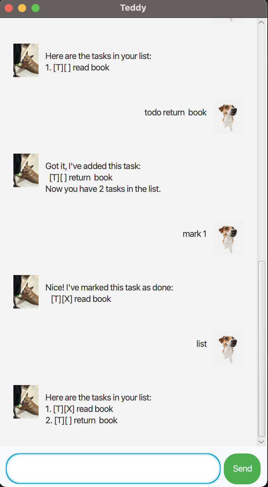

# Teddy User Guide



## Introduction
Teddy is a friendly AI task assistant designed to help you stay organized. It allows you to manage tasks efficiently by adding, marking, finding, and deleting them.

---

## Adding Deadlines

Teddy allows you to add tasks with deadlines using the `deadline` command.

### Command Format:
```
deadline <description> /by <date>
```
- `<description>` → The name of the task
- `<date>` → The deadline (in YYYY-MM-DD format)

### Example Usage:
```
deadline Finish project /by 2025-02-20
```

### Expected Output:
```
Got it! I've added this task:  
  [D][ ] Finish project (by: Feb 20 2025)  
Now you have 3 tasks in the list.
```

---

## Task Management Features

### Viewing all tasks
To see all your tasks, use:
```
list
```
**Expected Output:**
```
Here are the tasks in your list:
1. [T][X] Buy groceries
2. [D][ ] Finish project (by: Feb 20 2025)
3. [E][ ] Team meeting (from: Feb 21 2025 to Feb 22 2025)
```

### Adding Tasks
#### ToDo Tasks
```
todo <task description>
```
Example:
```
todo Read book
```
Expected Output:
```
Got it! I've added this task:
  [T][ ] Read book
Now you have 4 tasks in the list.
```

#### Event Tasks
```
event <description> /from <start date> /to <end date>
```
Example:
```
event Team meeting /from 2025-02-21 /to 2025-02-22
```
Expected Output:
```
Got it! I've added this task:
  [E][ ] Team meeting (from: Feb 21 2025 to Feb 22 2025)
Now you have 5 tasks in the list.
```

---

## Task Updates
### Marking a task as done
```
mark <task number>
```
Example:
```
mark 2
```
Expected Output:
```
Nice! I've marked this task as done:
  [D][X] Finish project (by: Feb 20 2025)
```

### Unmarking a task
```
unmark <task number>
```
Example:
```
unmark 2
```
Expected Output:
```
OK, I've marked this task as not done yet:
  [D][ ] Finish project (by: Feb 20 2025)
```

### Deleting a task
```
delete <task number>
```
Example:
```
delete 1
```
Expected Output:
```
Noted! I've removed this task:
  [T][X] Buy groceries
Now you have 4 tasks in the list.
```

---

## Finding Tasks
You can search for tasks using keywords.

### Searching for a task by keyword
```
find <keyword>
```
Example:
```
find project
```
Expected Output:
```
Here are the matching tasks in your list:
1. [D][ ] Finish project (by: Feb 20 2025)
```

---

## Exiting Teddy
When you're done, simply type:
```
bye
```
Expected Output:
```
Bye! Hope to see you again soon!
```
(The app will close after a short delay.)

---

## Summary of Commands

| Command        | Description |
|---------------|-------------|
| `list`            | View all tasks  |
| `todo <desc>`     | Add a ToDo task |
| `deadline <desc> /by <date>` | Add a deadline task |
| `event <desc> /from <start> /to <end>` | Add an event |
| `mark <num>`      | Mark task as done |
| `unmark <num>`    | Unmark task as not done |
| `delete <num>`    | Delete a task |
| `find <keyword>`  | Find tasks by keyword |
| `bye`             | Exit the application |

---

## Getting Started
Type a command in the input box and press **Enter** or click **Send** to begin using Teddy.
